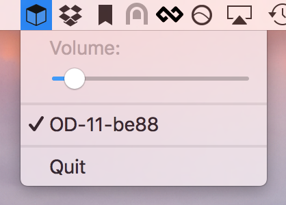

# OrthoBar

A Mac OSX toolbar application providing global keyboard shortcuts for controlling
the [OD-11 cloud speaker](https://www.teenageengineering.com/products/od-11)
from Teenage Engineering



**This project is in development. Your help is much appreciated**

## Install

[Download latest build](https://github.com/wallin/ortho-ctrl/releases) and
install the app like any other Mac app.

## Usage

| Action          | Shortcut       |
|-----------------|----------------|
| Volume up       | ctrl + alt + p |
| Volume down     | ctrl + alt + n |
| Next track      | ctrl + alt + f |
| Previous track  | ctrl + alt + b |
| Toggle playback | ctrl + alt + m |

## Build

This project uses [Cocoapods](https://cocoapods.org/) so you need to run:

```bash
$ pod install
```

## Package

First build the project for Archive.
Then create a DMG using the [appgdmg](https://github.com/LinusU/node-appdmg) tool

```bash
$ appdmg appdmg.json OrthoBar.app
```

## TODO

- [x] Auto discover device IP
- [x] Handle multiple groups
- [x] Volume slider
- [x] More actions, like skipping tracks
- [x] Show real device name in list
- [ ] Configurable shortcuts
- [ ] Show connection status in toolbar icon
- [ ] App Icon
- [ ] Upload to App Store

## Licence

MIT
